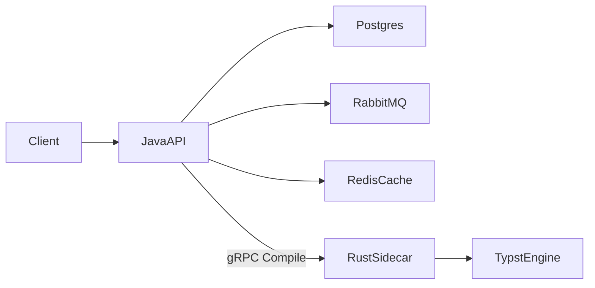

# Typst pipeline: productionization roadmap

This is the living iterated plan. Re-read and edit this file as you learn; do not try to land every phase in one PR.

**Status:** Phases 0–6 are in-repo. Compose is the first real deploy (Proxmox LXC). Kustomize `k8s/overlays/local` and `prod` cover in-cluster Postgres/Redis/RabbitMQ, gRPC probes, NetworkPolicy, and sidecar HPA. k6 lives in `scripts/stress/`. Iterate this file as you learn; do not treat the stack as finished production.

**Locked choices**

- Rust is a **gRPC compile sidecar only**. Java owns HTTP, DB, queue, cache, and job state.
- **RabbitMQ first** for job/work events and application event logs (Kafka noted as a later cloud swap).
- **Start by deleting and simplifying**, not by adding K8s.

**What this repo actually is today**

- Java is the HTTP API: load template from Postgres (Caffeine), validate field keys + JSON Schema `required`, call the Rust gRPC sidecar, return PDF (or 202 + poll).
- Rust is a **stateless** gRPC compile sidecar: `Compile(job_id, template_source, inputs_json)` and `Health()` with **no Redis**. Templates bind via `sys.inputs.data`.
- Redis remains on the Java side only (short-lived PDF cache / job status / leftover idempotency). There is no `pdf:jobs` stream and no Rust `REDIS_URL`.
- gRPC `Health` returns `{ ok, typst_version }`. Java Actuator includes a compiler health indicator.
- Rabbit is **off** in the default profile (`PDFGEN_RABBIT_ENABLED` unset / `pdfgen.rabbit.enabled: false`, in-process worker). Compose sets `PDFGEN_RABBIT_ENABLED=true` with profiles `local` and `prod`.

Target: Java = business API; Rust = stateless `Compile(template, inputs) -> pdf`; RabbitMQ = async jobs + events; Redis optional short-lived PDF cache; Postgres = templates + job audit.

Current (Phase 4) path: Client → Java API (API key, idempotency) → Postgres templates + Rabbit work queue (or in-process fallback) → gRPC Compile → Rust sidecar (`sys.inputs`) → PDF. Job rows are updated to compiling/done/error/`compile_ms`. Domain events `job.queued` / `job.compiled` / `job.failed` go to `pdfgen.events`. Sync wait uses Redis status, not `Thread.sleep` on a stream.

---

## Phase 0 — Simplify and remove legacy (done)

Goal: one honest demo path, fewer files, no behavior expansion.

**Delete or stop shipping**

- Dual seed/schema: [`migrations/V1__init.sql`](../migrations/V1__init.sql) vs seeder DDL vs [`scripts/seed-data.sql`](../scripts/seed-data.sql). Keep **one** SQL schema (prefer Flyway later; for this phase `migrations/` is source of truth).
- Stop seeding [`templates/**/_test_compile.typ`](../templates/invoice/_test_compile.typ) as fake template versions.
- Overlapping compose/runbooks: keep [`docker-compose.yml`](../docker-compose.yml) + one prod overlay ([`docker-compose.prod.yml`](../docker-compose.prod.yml)); Portainer compose / `setup.sh` removed.
- Dead Java: unused `JobStatus` (deleted), unused `Template.schema` usage (column kept for Phase 1), unused `invalidateCache` (deleted), toy `/api/v1/health` that ignored Actuator (deleted; use `/actuator/health`).
- Do **not** delete [`compile.proto`](../rust-compiler/proto/compile.proto) — Phase 2 will own it. Redis-in-gRPC-health is marked dead in code comments.

**Fix without new features**

- Align `pdfgen.queue.sync-timeout-ms: 200` in [`application.yml`](../java-api/src/main/resources/application.yml) with the `@Value` default in the controller (both 200).
- Exclude `_test_compile.typ` from seed scripts ([`scripts/seed_templates.py`](../scripts/seed_templates.py)).
- Restore a real Gradle wrapper under [`java-api/`](../java-api/) (`gradlew`, `gradlew.bat`, `gradle-wrapper.jar`).
- Rename placeholder package `com.yourco.pdfgen` when you next touch Java (skipped in this phase for a smaller diff).

**Inventory, don’t yet rewrite**

- Invoice/RRSP templates import Typst Universe packages (`tiaoma`, `cetz`) that `SingleSourceWorld` cannot resolve. Drop or vendor packages in Phase 1.

### Template compile inventory (Phase 0)

`SingleSourceWorld` has no package resolver and no Universe cache. Local `typst compile` can fetch `@preview/...`; the in-service worker cannot.

| Path | Seeded as a form/version? | Compiles in-service? | Notes |
|------|---------------------------|----------------------|--------|
| `templates/minimal/v1.0.0.typ` | yes (`minimal` / `1.0.0`) | yes | Fast path; no packages |
| `templates/invoice/v2.0.0.typ` | yes | yes | Simple `vars` template; honest demo target |
| `templates/invoice/v2.1.0.typ` | yes | **no** | `#import "@preview/tiaoma:0.3.0"` |
| `templates/report/v1.0.0.typ` | yes | yes | |
| `templates/report/v2.0.0.typ` | yes | yes | Tables/columns; no packages |
| `templates/contract/v1.0.0.typ` | yes | yes | Multi-page; no packages |
| `templates/dashboard/v1.0.0.typ` | yes | yes | Uses Typst 0.12 `locate` |
| `templates/legal/v1.0.0.typ` | yes | likely | No Universe imports; requests `Linux Libertine` (may fall back to bundled fonts) |
| `templates/rrsp/v1.0.0.typ` | yes | **no** | `#import` `tiaoma` + `cetz` |
| `templates/invoice/_test_compile.typ` | **no** (excluded) | n/a | Local CLI fixture that pastes `#let vars` |
| `templates/rrsp/_test_compile.typ` | **no** (excluded) | n/a | Local CLI fixture |

### Phase 0 deletions (this pass)

| Path | Why |
|------|-----|
| `seeder/seed.sh` | Competing DDL (`BIGSERIAL` / `VARCHAR` vs `migrations/V1__init.sql` UUID schema) plus glob that seeded `_test_compile.typ` |
| `seeder/Dockerfile` | Only consumer of `seeder/seed.sh`; Portainer-only image |
| `seeder/` (empty dir) | Removed after deleting the two seeder files |
| `scripts/seed-data.sql` | Frozen duplicate of `templates/` with encoding damage; second seed source |
| `docker-compose.portainer.yml` | Overlapping runbook; used pre-built images + seeder |
| `setup.sh` | TrueNAS/Portainer one-shot that seeded every `*.typ` including `_test_compile.typ` |
| `java-api/src/main/java/com/yourco/pdfgen/model/JobStatus.java` | Unused enum; job status remains a Redis/Postgres string |

### Leftover on purpose (do not treat as unfinished Phase 0)

| Path | Why it stays |
|------|----------------|
| `rust-compiler/proto/compile.proto` | Phase 2 owns the contract rewrite |
| `rust-compiler/src/worker.rs` | Redis consumer + `build_vars_block`; **Phase 0 keeps this** until Phase 2 cutover |
| `rust-compiler/src/main.rs` gRPC `Health` Redis `XLEN` | Marked dead in Phase 0; removed in Phase 2 |
| `templates/**/_test_compile.typ` | CLI fixtures; not seeded |
| `templates/invoice/v2.1.0.typ`, `templates/rrsp/v1.0.0.typ` | Real templates; fail in-service until Phase 1 package policy |
| `Template.schema` JPA column | Unused until Phase 1 JSON Schema validation |
| `com.yourco.pdfgen` package name | Optional rename deferred |
| `scripts/pythonstressor.py`, `scripts/test-load*.ps1` | Replaced in Phase 6, not now |
| `docker-compose.prod.yml` | The one prod overlay kept in Phase 0 |

**Gradle wrapper (restored):** `java-api/gradlew`, `java-api/gradlew.bat`, `java-api/gradle/wrapper/gradle-wrapper.jar` (Gradle 8.7). `.gitignore` un-ignores `**/gradle-wrapper.jar` so the jar can be committed. `java-api/Dockerfile` runs `./gradlew bootJar`.

**Exit criteria:** `docker-compose up --build` + functional script still works; seed creates only real form/version rows; README matches Redis-worker reality; leftover files listed above.

**Worktree note:** Other phases may have landed files in the same working tree (`k8s/`, `openapi/`, RabbitMQ compose, gRPC Java client). Phase 0 did not add those. If `worker.rs` is missing, a later phase deleted it early — restore it before treating Phase 0 as the sole diff.

---

## Phase 1 — Template matching (replace vars prepend) (done)

Today’s “file append” is **in-memory source surgery**: Rust string-builds Typst and concatenates it onto the template.

**Done in this pass:** templates bind `#let vars = json.decode(sys.inputs.at("data", default: "{}"))`. Universe `@preview` imports were stripped (native Typst stand-ins for QR/chart). Field keys are identifier-safe; `templates.schema` `required` is enforced. `_test_compile.typ` is `typst compile --input data=...` plus `fixture.json`. `worker.rs` / `build_vars_block` are gone (Phase 2 cutover).

**Recommended binding:** Typst `sys.inputs` (data injection, not source rewrite).

1. Change [`world.rs`](../rust-compiler/src/world.rs) so the Typst `Library` is built with an inputs map (JSON string or per-key strings).
2. Delete `build_vars_block` / `format!("{}\n{}", vars_block, typ_template)` in [`worker.rs`](../rust-compiler/src/worker.rs).
3. Update every real `.typ` under [`templates/`](../templates/) from `vars.x` / `vars.at(...)` to `sys.inputs` (or one line `#let vars = json.decode(sys.inputs.at("data"))` to keep templates stable).
4. Rewrite `_test_compile.typ` to `typst compile --input ...` instead of pasted `#let vars`.
5. Validate field **keys** (identifier-safe) and bound payload size in Java; start using `templates.schema` JSON Schema for required fields.
6. Package policy: vendor fonts/assets only, or strip Universe imports from server templates. Do not pretend `@preview/...` works until the World has a package resolver.

**Why not `typst query`:** it extracts from a compiled doc; it does not bind request fields. **JSON virtual file** (`json("data.json")`) is a fine alternative if you prefer multi-file World over `sys.inputs`; pick one and stick to it.

**Exit criteria:** no Typst syntax generated from user strings; a template + JSON fixture compiles locally and through the worker.

---

## Phase 2 — Extremely simple Rust sidecar + Java gRPC (done)

Make the architecture match the README you actually want.

**Done in this pass:** Rust is a Redis-free gRPC sidecar (`Compile` + `Health`). Java loads templates from Postgres (Caffeine), calls the sidecar on `POST /generate`, and no longer XADDs `pdf:jobs`. Sync wait is `CompletableFuture.get(timeout)` (no `Thread.sleep`). Async fallback is an in-process executor until Phase 3 RabbitMQ. Leftover Rabbit/OpenAPI/k8s files compile but are not the job backbone (`pdfgen.rabbit.enabled: false`).

**Rust sidecar contract (replace current proto)**

- `Compile(job_id, template_source, inputs_json) -> { pdf_bytes, pages, compile_ms, error }`
- `Health() -> { ok, typst_version }` with **no Redis**
- Stateless: no Redis client, no stream loop, no template fetch
- One compile at a time per request; scale with replicas, not `WORKER_THREADS` Redis consumers

**Java**

- Add grpc-java (or grpc-spring-boot-starter) client generated from the same proto.
- Load template from Postgres (Caffeine cache; Redis template keys can die).
- Sync `POST /generate`: call sidecar with deadline; return PDF.
- Async: publish job to RabbitMQ (Phase 3 if Rabbit is not ready yet; until then a Java `@Async`/virtual-thread caller is acceptable as a stepping stone).
- Kill Tomcat busy-wait `Thread.sleep(5)` in [`JobService.awaitResult`](../java-api/src/main/java/com/yourco/pdfgen/service/JobService.java).

**Delete after cutover:** Rust `worker.rs` Redis loop, Redis stream `pdf:jobs`, compose `REDIS_URL` on rust-compiler.

**Exit criteria:** rust image has no Redis env; `grpcurl` Health + Compile works; Java generate path no longer XADDs.

---

## Phase 3 — Spring Boot as the real API (OpenAPI, jobs, RabbitMQ) (done)

**Done in this pass:** spec-first [`openapi/openapi.yaml`](../openapi/openapi.yaml) + springdoc; RabbitMQ work queue `pdfgen.jobs` / events `pdfgen.events` / DLQ; Java workers call gRPC; Postgres job audit to done/error/`compile_ms`; JSON stdout logs (not every line to Rabbit); Actuator readiness DB+Redis+Rabbit+gRPC; `application-local.yml` / `application-prod.yml`; compose runs RabbitMQ. `pdfgen.rabbit.enabled: false` remains the default so tests/bootRun work without a broker.

- **OpenAPI:** `springdoc-openapi` on `/v3/api-docs` + Swagger UI; spec checked into [`openapi/openapi.yaml`](../openapi/openapi.yaml) (code-first then dump, or spec-first — pick spec-first if you want the learning win).
- **RabbitMQ:**
  - Exchange `pdfgen.jobs` (work queue: generate requests for async workers in Java).
  - Exchange `pdfgen.events` (log-like domain events: `job.queued`, `job.compiled`, `job.failed` with `job_id`, `form`, `compile_ms`).
  - DLQ for poison messages.
- Keep **stdout JSON logs** (Spring + `tracing` JSON). Do not dump every log line into RabbitMQ; that is what Loki/ELK is for later. Events in AMQP are the learning-shaped “logs with a broker.”
- **Job audit:** actually update Postgres `jobs` to done/error/`compile_ms` (today it is write-once `pending`).
- **Actuator:** real readiness (DB + Rabbit + gRPC health); lock down metrics for prod.
- Profiles: `application-local.yml` / `application-prod.yml` (and matching Rust env). Secrets from env, never compose defaults in prod.

---

## Phase 4 — Harden (circuit breaker and friends) (done)

**Done in this pass:** Resilience4j on the gRPC client (timeout, retry only for retryable sidecar failures, circuit breaker, bulkhead); payload limits; `X-API-Key`; `Idempotency-Key`; gRPC deadlines + max message size. Learning backlog below was not implemented.

Implement these; the list after that is study-only until you want another milestone.

**Do implement**

- Resilience4j on the gRPC stub: **timeout, retry (idempotent Compile only if you add idempotency keys), circuit breaker, bulkhead**.
- Payload limits (template size, field count, PDF size).
- API key or gateway auth before anything is reachable on a LAN/Proxmox bridge.
- Idempotency-Key header for generate (store job_id, replay PDF).
- gRPC deadlines + max message size; optionally mTLS Java↔Rust later.

**Learning backlog (do not block Phase 4)**

- Hexagonal ports: `TemplateStore`, `CompilerPort`, `JobPublisher` so Redis/Rabbit/gRPC stay swappable.
- Transactional outbox for events (job row + event in one DB txn).
- OpenTelemetry traces (`job_id` as trace attribute) across Java → Rabbit → gRPC.
- JSON Schema validation of `fields` vs `templates.schema`.
- Object storage (MinIO now, S3/Blob later) instead of Redis TTL PDFs.
- Contract tests on the proto (buf breaking-change CI).
- Rate limit / per-tenant quota.
- Kafka later: same event payloads, different binder (`Spring Cloud Stream` helps the swap).

---

## Phase 5 — Docker, env split, Proxmox LXC, then K8s/cloud (done)

**Local Compose:** postgres, rabbitmq, java-api, rust-compiler, redis result cache.

**Prod overlay:** [`docker-compose.prod.yml`](../docker-compose.prod.yml) — resource limits, no published DB/Rabbit ports, secrets from env, JSON logs.

**Proxmox LXC:** [`docs/PROXMOX_LXC.md`](PROXMOX_LXC.md) — nesting + keyctl, Compose first, then k3s.

**Kubernetes:** Kustomize [`k8s/overlays/local`](../k8s/overlays/local) and [`k8s/overlays/prod`](../k8s/overlays/prod). In-cluster Postgres/Redis/RabbitMQ, Java Actuator probes, sidecar `grpc.health.v1` probes, NetworkPolicy (only java-api → rust-compiler:50051), CPU HPA on rust-compiler. Secrets are placeholders. Do not invent AWS/Azure services until this runs on k3s.

**Local:** compose with `postgres`, `rabbitmq`, `java-api`, `rust-compiler`, optional `redis` (result cache) or MinIO.

**Prod overlay:** resource limits, no published DB ports, secrets, JSON logs.

**Proxmox LXC (first real deploy)**

- Nesting + keyctl (or a privileged LXC) so Docker Engine runs inside the container.
- Deploy **Compose first**, not K8s. Confirm generate + Rabbit + sidecar under memory limits that match the LXC.
- Then k3s **or** keep Compose until the Helm chart is boring.

**Kubernetes (portable to AWS EKS / Azure AKS)**

- One chart or Kustomize overlay: `local` / `prod`.
- Deployments: java-api, rust-compiler (HPA on CPU or queue depth), postgres (or cloud RDS/Azure PG), RabbitMQ (or Amazon MQ / Azure Service Bus later).
- Probes: Spring Actuator + gRPC Health.
- NetworkPolicy: only Java may reach Rust:50051.
- Do not invent cloud-specific services until the chart runs on k3s in the LXC.

---

## Phase 6 — Proper stress scripts (done)

k6 suite: [`scripts/stress/`](../scripts/stress/).

- **k6** HTTP: sync generate, async generate+poll, 404/400/413/422, mixed templates.
- **Scenarios:** warmup, sustained RPS, spike, sidecar kill (circuit breaker), Rabbit flood, oversized field rejection.
- **Reports:** k6 `http_req_duration` p50/p95/p99, error rate. Default generate SLOs: error rate < 5%, p95 < 5s, p99 < 10s.
- Keep [`scripts/test_functional.py`](../scripts/test_functional.py) as the smoke test (OpenAPI invoice 2.0.0 example). Python `stress_sync.py` / `stress_errors.py` remain as a no-k6 fallback.

---

## Suggested PR / learning sequence

Do not implement this whole plan in one shot. Iterate this markdown after each phase.

1. Phase 0 cleanup PR (this is the first coding milestone; done in-repo, PR not created here).
2. Phase 1 template matching (can share a PR with 2 if you want one compile-path rewrite).
3. Phase 2 gRPC sidecar + Java client; delete Redis workers.
4. Phase 3 OpenAPI + RabbitMQ events/jobs.
5. Phase 4 Resilience4j + auth + limits.
6. Phase 5 compose overlays + k8s manifests; deploy LXC.
7. Phase 6 stress suite against that deploy.
